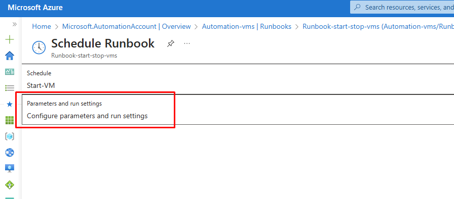

## Create a Automation Accounts

* Searche for Automation Account in the Azure portal and select : 

* Click in create and complete all fileds.

* Select System Assigned. [Docs - System Assigned](https://learn.microsoft.com/en-us/entra/identity/managed-identities-azure-resources/overview)

* Select Public Access and fill in the tag and create + review

* Go to Automantion Account created and select Runbooks and click in Create a runbook : 

* Complete all fields and click in Next and after Review + Create.

* After creation, the editor will automatically open, click on the right panel and paste the Powershell script and click on Save:
* You can get the script here : [Script-automation](script.ps1)

* Now we have to configure the permissions on the Automation Account, return to Automation Account panel and select Identity :

* Click on Azure role assignments.

* Click on Add role assignment.

* In the tab that opened on the right, complete the fields and click in Save.

* Return to Runbooks and select one you created.

* Click on Edit and select Edit in portal.

* Now we can test, before check the Tags of VMs.

* On editor page click on Test pane.

* Fill in your TAG and select TRUE to shut down the VMs and click on Start. FALSE is to turn on the vms.

* Wait few minutes to get the result :

* Return to Editor panel and we will Publish the Runbook clicking on Publish.

* To schedule this Runbook, go to the Runbook page and select Schedules and click on Add a schedule.

* On Schedule Runbook, select schedule and after select Add a schedule.

* Complete with your needed and click on Create.

* Now select Configure parameters and run settings.

* On Configure parameters and run settings and click on Create and After OK again.

* Configure to Stop VM.

* After configuration, you can check the Jobs on Runnbook page by selecting Jobs.

* You can check all logs per job by clicking on the job name.

* After job start vms completed :

